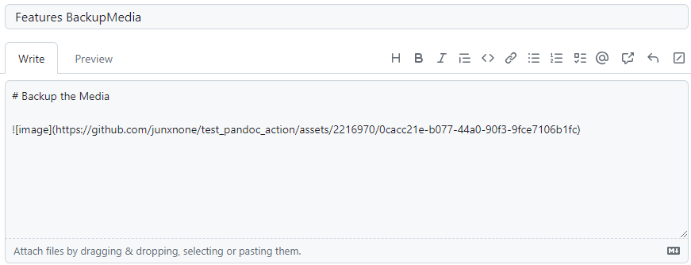
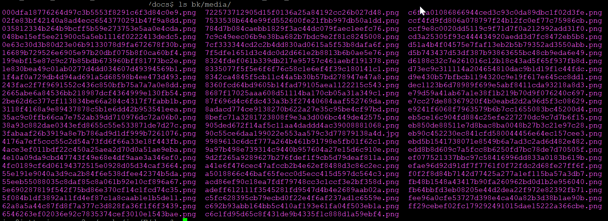

---
Title | Features BackupImages
-- | --
Created @ | `2023-06-25T15:39:01Z`
Updated @| `2024-05-06T07:25:17Z`
Labels | ``
Edit @| [here](https://github.com/junxnone/twiki/issues/36)

---
# Backup the Images
- backup the images in markdown to your backup folder
- pandoc `--extract-media`

  - the images

## Issues
- 多个工作流之间传递变量
- 目录权限 `move` --> `copy`

## Reference
- [pandoc-action-example](https://github.com/pandoc/pandoc-action-example/tree/master)
- [pandoc: Reader Options](https://pandoc.org/MANUAL.html#reader-options)
- [有关将环境变量写入 GITHUB_ENV 的示例](https://docs.github.com/zh/actions/using-workflows/workflow-commands-for-github-actions#example-of-writing-an-environment-variable-to-github_env)
