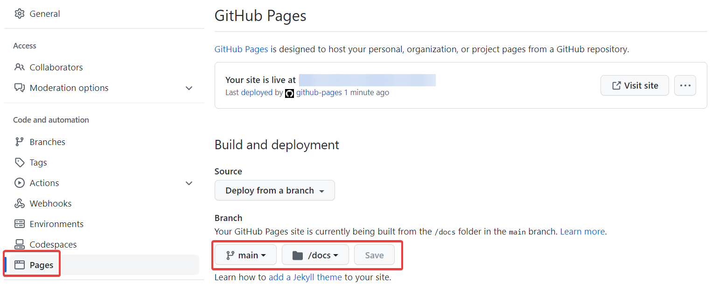
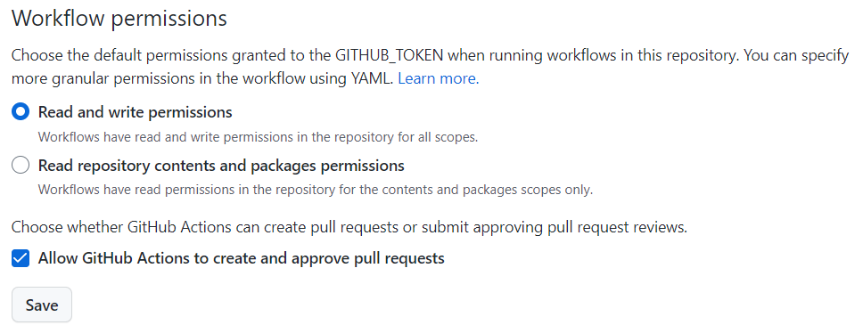
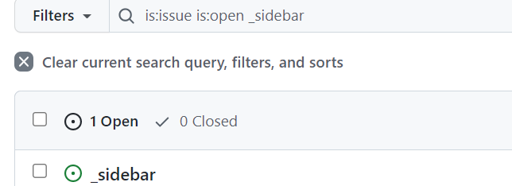

-----

| Title     | Guide                                               |
| --------- | --------------------------------------------------- |
| Created @ | `2022-12-15T02:44:35Z`                              |
| Updated @ | `2023-03-17T15:02:48Z`                              |
| Labels    | `Features`                                          |
| Edit @    | [here](https://github.com/junxnone/twiki/issues/23) |

-----

# Guide

## 1 Use this template


## 2 User Config In `index.html`

``` 
  <title>yourWikiName</title>
```

``` 
    name: 'yourWikiName',
    repo: 'yourGithubAccount/yourRepo',
    loadSidebar: '_sidebar.md',
    loadNavbar: '../NAV.md',
```

    namespace: 'yourRepo',

## 3 Deploy with Github page



## 4 Enable Issue2md

### 4.1 Enable Action



### 4.2 Create Issue `_sidebar` to edit your sidebar



## 5 Create Issue `README` update the index.html

## 6 Remove the markdown files in docs/ to Build your wiki

## 7 Create more Issues to enjoy your wiki
